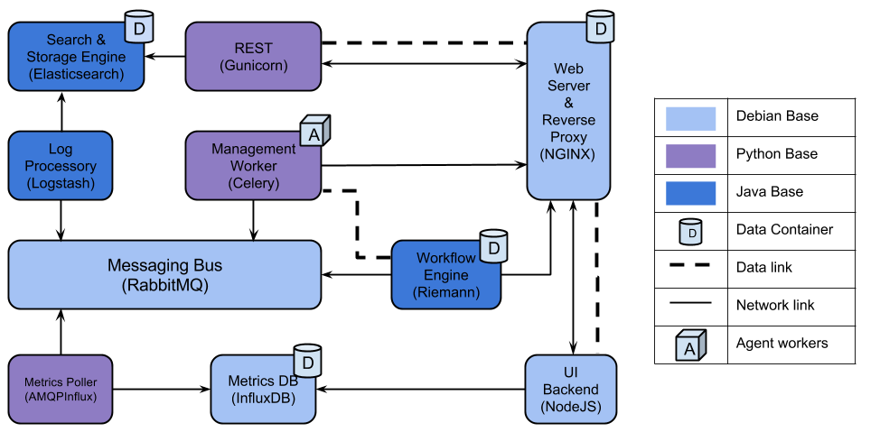

Cloudify-Packager
=================

Cloudify's configuration objects we use to build Cloudify's Management environments, agents and demo images.

### [Docker](http://www.docker.com) Images

#### Current Implementation of default Management Environment Architecture



#### Building Cloudify's Docker Images

We use [docker-compose](https://docs.docker.com/compose/) to generate our images.
Configuration for all images can be found under the `docker` directory in a corresponding sub-directory.
`docker-compose.yml` contains the configuration for the build.

To build, install `docker-compose` and execute the following:

```shell
virtualenv cloudify
source cloudify/bin/activate
pip install docker-compose

sudo docker-compose -p cloudify build javabase pythonbase
sudo docker-compose -p cloudify build
```

Port exposure, commands, volumes and environment variables are contained within the Dockerfiles.
In addition, each image receives a [SERVICE]-NOTICE.txt file with the relevant licensing information.

#### Running the containers locally

A `run` shell script is provided which allows anyone to run all containers on a local machine.
The script contains everything that's necessary to run Cloudify's Management Environment on a local machine using a local Docker daemon.

When bootstrapping Cloudify, Cloudify's CLI actually uses the same logic to run the containers using a single method that implements that logic.
In Cloudify 3.3, this implementation will be removed and replaced with a logic in the Manager Blueprints.


### [packman](http://packman.readthedocs.org) configuration

Packman is used to generate Cloudify's Agent Packages.
This repository contains packman's configuration for creating the packages.

In Cloudify 3.3, Packman will no longer be used to generate the agent tar files but rather only to package them into deb/rpm binaries.
Instead, our [agent-packager](https://github.com/cloudify-cosmo/cloudify-agent-packager) will be used to generate the agent tar files providing a much more streamlined, easy to use interface to create a Cloudify agent.

#### package-configuration

The package-configuration folder contains the init scripts and configuration files for Cloudify's packages.

#### package-templates

The package-templates folder contains the bootstrap scripts that are used to install Cloudify's packages.

#### packages.py

The packages.py file is the base packman configuration file containing the configuration of the entire stack (including agents).


### [Vagrant](http://www.vagrantup.com)

Cloudify's packages are created using Vagrant generated VM's (currently on AWS).

The Vagrant folder contains Vagrant configuration for different components that are generated using packman:

- A VM is initialized.
- Packman is installed on the machine alongside its requirements.
- If a virtualenv is required, it is created and the relevant modules are installed in it.
- Packman is used to create the environment into which the components are retrieved.
- Packman is used to create the package.

NOTE: the Windows Agent Vagrantfile uses a premade image already containing the basic requirements for creating the Windows agent.

#### image-builder

Creates a Vagrant box with a Cloudify Manager preinstalled for Virtualbox, AWS and HPCloud. This provides our Quickstart.
